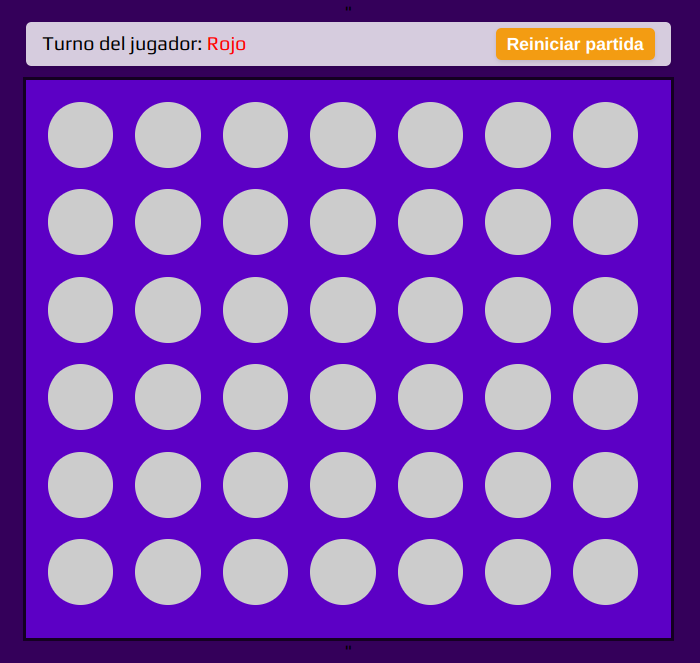

# Connect Four

The **Connect Four** game for two players! This project was built using **HTML**, **CSS**, and **JavaScript** to recreate the classic strategy game in a digital format.

## Description

**Connect Four** is a fun and competitive game where two players take turns dropping their discs into a grid. The goal is to be the first to connect four discs in a row, column, or diagonal. 

## Features

- 🎮 Two-player mode for local gameplay.
- 🟡 Intuitive drag-and-drop or click-to-place controls.
- 🧠 Highlights the winning combination when a player wins.

## Installation

1. Clone this repository to your local machine:
   ```bash
   git clone https://github.com/AnthonnyDev07/Connect4-Game.git
